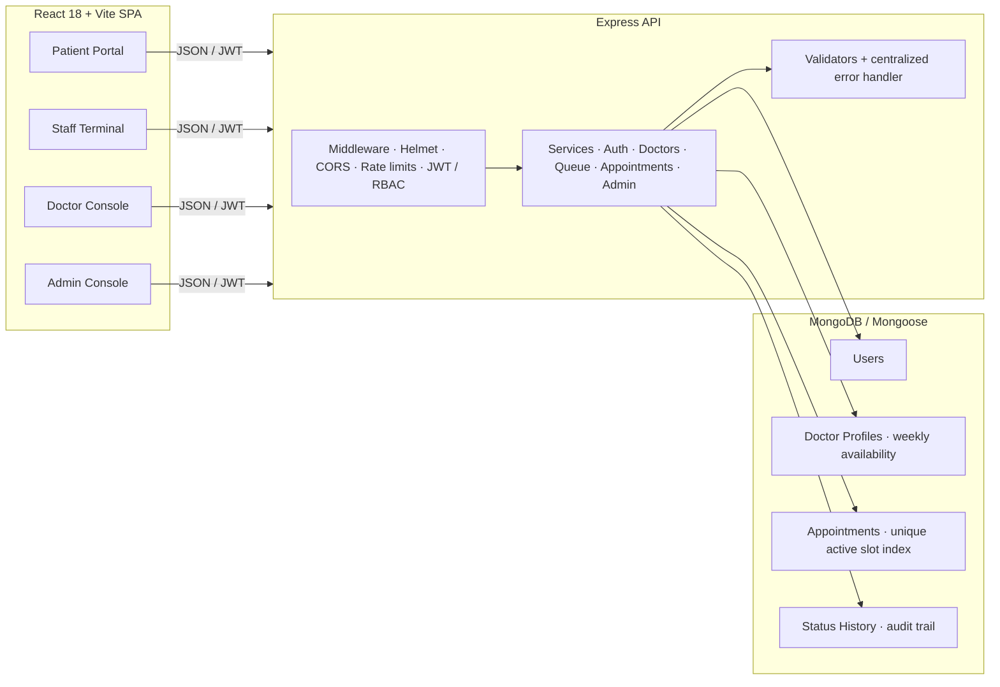
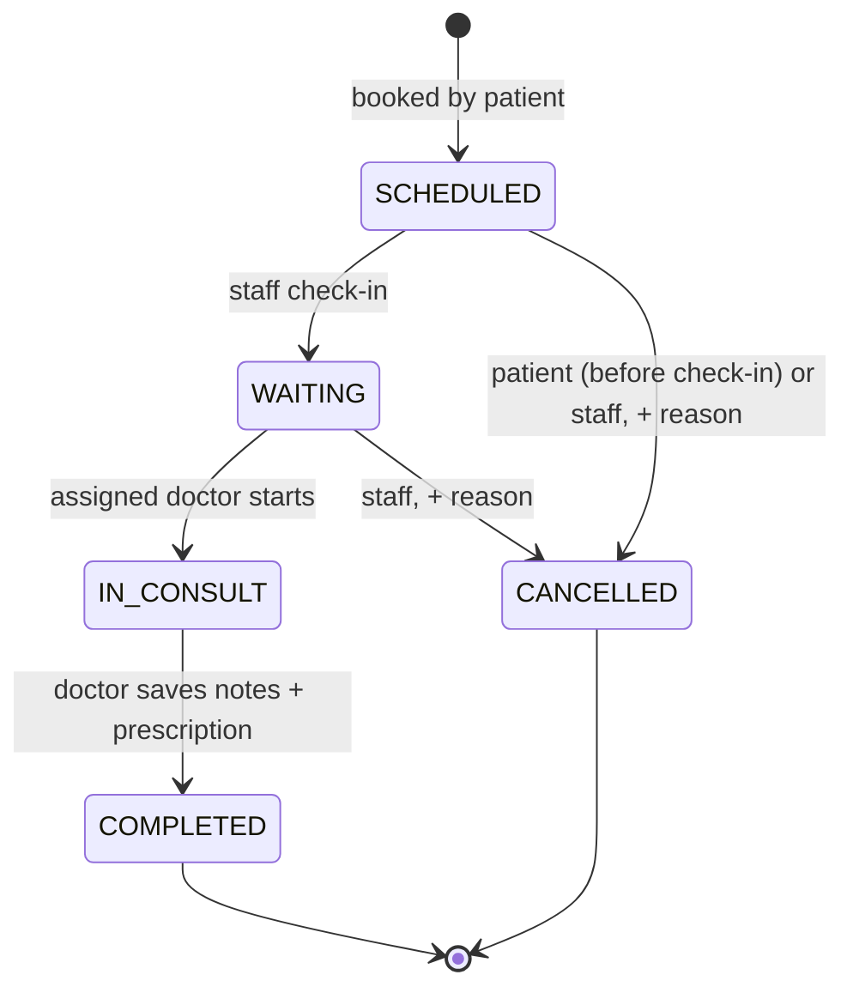

<p align="center">
  
</p>

<p align="center">
  <strong>The front desk, digitised.</strong> A full-stack MERN application that replaces a small clinic's
  paper registers with <em>appointment booking, a live patient queue, conflict-safe slot reservation,
  wait-time estimation, and a complete clinical audit trail</em> — wrapped in four role-specific portals.
</p>

<p align="center">
  <a href="https://github.com/kaurmoni0013/MediQueue/actions/workflows/node.js.yml"></a>
  <a href="https://nodejs.org"></a>
  <a href="https://expressjs.com"></a>
  <a href="https://www.mongodb.com"></a>
  <a href="https://react.dev"></a>
  <a href="https://vite.dev"></a>
  <a href="https://jwt.io"></a>
  <a href="https://mediqueue-1cu4.onrender.com"></a>
  <a href="LICENSE"></a>
</p>

## 🌐 Live Demo

**Try it live:** [https://mediqueue-1cu4.onrender.com](https://mediqueue-1cu4.onrender.com)

The deployed instance comes pre-seeded with demo data — log in and explore every role:

| Role | Email | Password |
| --- | --- | --- |
| Admin | `admin@mediqueue.com` | `Admin1234` |
| Front desk staff | `staff@mediqueue.com` | `Staff1234` |
| Doctor | `ananya@mediqueue.com` | `Doctor1234` |
| Doctor | `rajiv@mediqueue.com` | `Doctor1234` |
| Patient | `patient@mediqueue.com` | `Patient1234` |

> The app runs on a [Render](https://render.com) free instance, so the first visit may take ~30s to wake up.

---

## 📋 Table of Contents

- [Why MediQueue?](#-why-mediqueue)
- [Live Demo](#-live-demo)
- [Highlights](#-highlights)
- [Screens](#-screens)
- [Architecture](#-architecture)
- [The Appointment State Machine](#-the-appointment-state-machine)
- [Tech Stack](#-tech-stack)
- [Quick Start](#-quick-start)
- [Demo Walkthrough](#-demo-walkthrough)
- [API Overview](#-api-overview)
- [Security](#-security)
- [Testing & CI](#-testing--ci)
- [Project Layout](#-project-layout)
- [Roadmap](#-roadmap)
- [License](#-license)

---

## 💡 Why MediQueue?

Waiting rooms run on guesswork. Patients crowd the desk asking "how much longer?", staff juggle paper
registers, and doctors never know who is next. **MediQueue digitises that whole loop** for a small clinic:

- **Patients** book their own slot against a doctor's real schedule — and watch their queue position tick down live.
- **Front-desk staff** check people in, reschedule, cancel, and see every doctor's queue on one board.
- **Doctors** pull up exactly who is waiting, start and complete consultations, and leave clinical notes + prescriptions.
- **Admins** manage the entire roster — doctors (with weekly availability schedules), staff, and patients — and watch clinic-wide stats.

Because every decision point is validated **server-side** (never just in the UI), the system cannot be
fooled by double-booked slots, illegal status flips, or unauthorised users.

---

## ✨ Highlights

### 🗂️ Four portals, one clinic

| Portal | Who it serves | Home route |
| --- | --- | --- |
| 🛡️ **Admin Console** | Clinic owner / manager | `/admin/dashboard` |
| 🧑‍💼 **Staff Terminal** | Front desk / reception | `/staff/dashboard` |
| 🩺 **Doctor Console** | Consulting physicians | `/doctor/dashboard` |
| 🧑 **Patient Portal** | The people being treated | `/patient/dashboard` |

Every route is guarded **twice**: client-side route guards *and* server-side role middleware with
per-record ownership checks. The UI is the convenience; the API is the authority.

### ⚙️ Signature features

| Feature | What it does |
| --- | --- |
| 🎯 **Conflict-safe bookings** | Slots are generated from each doctor's weekly schedule × consultation duration, validated at the instant of booking, *and* protected by a partial unique index on `(doctor, date, startTime)` for active statuses — two patients can **never** hold the same slot, even under simultaneous requests. |
| 🔢 **Live queue positions** | Position is the 1-based rank in the list of active appointments, ordered by start time. Computed on demand and never stored — it can't go stale. |
| ⏱️ **Estimated wait times** | `patients ahead × doctor's avg consultation duration`, derived from live data. Patients see `#2 · ~15 min` style updates. |
| 🔁 **Strict status machine** | `SCHEDULED → WAITING → IN_CONSULT → COMPLETED` (+ `CANCELLED`), enforced in the service layer with actor rules. Invalid transitions return specific, machine-readable error codes. |
| 🕵️ **Full audit trail** | Every status change is recorded with *who did it, when, and why* (`StatusHistory`). |
| 👨‍⚕️ **Clinical workflow** | Doctors must add clinical notes or a prescription before completing; patients only see them **after** the visit completes. |
| 🔄 **Live updates** | React Query polling keeps the queue, dashboards, and patient "next appointment" watch current automatically. |
| 🎛️ **Hand-rolled design system** | "Queue-ticket / scanner" aesthetic — dark terminal (default) or light, sodium-amber accent, monospaced numerals, LED status dots. No UI framework. |

### 🧪 At-a-glance

| | |
| --- | --- |
| 🧩 Status transitions | `SCHEDULED → WAITING → IN_CONSULT → COMPLETED` |
| 🛡️ Auth | JWT + bcrypt + **server-side session revocation** |
| 🚦 Rate limiting | Global `600 req/15 min` + login `20 req/15 min` |
| ⏳ Idle auto-signout | 10 minutes of inactivity |
| 📋 E2E checks | **67/67 passing** API smoke suite |
| 🔐 Production guard | Refuses to boot in production with the default JWT secret |

---

## 📸 Screens

> These are pixel-accurate previews of the interface, illustrated with the app's own design tokens.
> Real browser capture can be dropped into `docs/screenshots/` and referenced the same way.

| Patient portal — live queue & next appointment | Booking wizard — doctor → date → live slots |
| --- | --- |
|  |  |

| Staff terminal — today's queues across doctors | Doctor console — who is waiting next |
| --- | --- |
|  |  |

| Admin console — clinic-wide operating picture |
| --- |
|  |

---

## 🏗️ Architecture

Clean separation: a **stateless Express API** owns all business rules, a **React SPA** renders four
role-specific UIs on top, and **MongoDB** persists everything with query-friendly and race-preventing indexes.



Key design decisions baked into the data layer:

- **Indexes tuned for the hot paths** — `(doctor, date)` and `(patient, date)` for queue/conflict lookups,
  `(status, date)` for operational dashboards.
- **A race-condition safety net at the database level** — the partial unique index on
  `(doctor, date, startTime)` only applies to active statuses, so completed/cancelled slots can be
  re-booked while live ones can't ever collide.
- **Queue is a view, not a table** — positions and waits are derived on read from active appointments,
  so they're always consistent with the database.

---

## 🔄 The Appointment State Machine

The lifecycle of every appointment is a strict, role-guarded state machine — defined once in constants,
enforced in the service layer, and recorded to history on every step.



Rules enforced on every transition:

- Only the **assigned doctor** can start or complete a consultation.
- `COMPLETED` requires clinical notes **or** a prescription — empty completes are rejected.
- `CANCELLED` requires a reason and is only allowed from `SCHEDULED` (patient) or `SCHEDULED`/`WAITING` (staff).
- An invalid transition returns `409` with a specific `code` (`INVALID_STATUS_TRANSITION`, `CANNOT_CANCEL`, …).

---

## 🧱 Tech Stack

### Backend
| Technology | Role |
| --- | --- |
| **Node.js 18+** with **Express 4** | REST API server |
| **MongoDB + Mongoose 8** | Persistence, indexes, unique booking invariant |
| **jsonwebtoken + bcryptjs** | Authentication & password hashing |
| **express-validator** | Input validation at the route edge |
| **express-rate-limit** | Global + auth brute-force protection |
| **helmet + morgan + cors** | HTTP hardening, logging, CORS |
| **nodemon** | Dev reload |

### Frontend
| Technology | Role |
| --- | --- |
| **React 18 + Vite 5** | SPA shell & bundler |
| **react-router-dom 6** | Role-scoped routing + guards |
| **@tanstack/react-query 5** | Server state, caching, live polling |
| **axios** | Typed API layer |
| **lucide-react** | Iconography |

---

## 🚀 Quick Start

### Prerequisites

- **Node.js 18+** (tested up to 22)
- **MongoDB** reachable on `localhost:27017` (or point `MONGODB_URI` anywhere)

### 1️⃣ Backend

```bash
cd server
npm install
copy .env.example .env       # then set a strong JWT_SECRET
npm run seed                 # optional — creates demo data (see logins below)
npm run dev                  # http://localhost:5100
```

### 2️⃣ Frontend

```bash
cd client
npm install
npm run dev                  # http://localhost:5174  (proxies /api → :5100)
```

On Unix-family shells use `cp .env.example .env` instead of `copy`.

### 🔑 Demo logins

The seed script (`npm run seed`) creates a realistic clinic day with 2 doctors, 10 patients,
a full queue, and completed visit history:

| Role | Email | Password |
| --- | --- | --- |
| 🛡️ Admin | `admin@mediqueue.com` | `Admin1234` |
| 🧑‍💼 Staff | `staff@mediqueue.com` | `Staff1234` |
| 🩺 Doctor | `ananya@mediqueue.com` | `Doctor1234` |
| 🩺 Doctor | `rajiv@mediqueue.com` | `Doctor1234` |
| 🧑 Patient | `patient@mediqueue.com` | `Patient1234` |

> All patients share `Patient1234`; all doctors share `Doctor1234`.

---

## 🎬 Demo Walkthrough

1. 👤 **Log in as a patient** → browse doctors → book one of Dr. Sharma's free morning slots (e.g. **10:30**).
2. 🧑‍💼 **Log in as staff** → the appointment appears on today's board → **check the patient in** → status flips to *Waiting*.
3. 🩺 **Log in as Dr. Ananya** → open **Today's Queue** → **Start** the consultation → add clinical notes → **Complete**.
4. 👤 **Back as the patient** → open the appointment → the consultation card now shows the prescription and notes. 🎉

---

## 🔌 API Overview

<details>
<summary>Click to expand the full endpoint map (auth · booking · staff · doctor · admin)</summary>

```
Auth
  POST  /api/auth/register                        Register a patient → JWT
  POST  /api/auth/login                           Login → JWT
  GET   /api/auth/me                              Session profile (auto-attaches doctor profile)
  POST  /api/auth/logout                          Revokes every token issued to the user

Doctors & availability
  GET   /api/doctors                              Doctor directory (active doctors only)
  GET   /api/doctors/:id                          Single doctor profile + schedule
  GET   /api/doctors/:id/availability?date=       Live slot grid for a doctor + date

Appointments
  POST  /api/appointments                         Book an appointment (server re-verifies slot)
  GET   /api/appointments/my?tab=upcoming|completed|cancelled   Patient's own appointments
  GET   /api/appointments/:id                     Detail (+ queue position & est. wait when active)
  GET   /api/appointments/:id/history             Status audit trail
  PATCH /api/appointments/:id/status              Staff: SCHEDULED → WAITING     (STAFF)
  PATCH /api/appointments/:id/start-consultation  Doctor: WAITING → IN_CONSULT   (DOCTOR)
  PATCH /api/appointments/:id/complete-consultation  Doctor: → COMPLETED + notes (DOCTOR)
  PATCH /api/appointments/:id/cancel              Cancel + reason                 (patient own / staff)
  PATCH /api/appointments/:id/reschedule          Reschedule + conflict check     (STAFF)

Staff operations
  GET   /api/staff/today                          Today's board + per-doctor now-serving
  GET   /api/staff/appointments                   Filterable, paginated appointments
  GET   /api/staff/patients                       Searchable patient directory
  GET   /api/staff/summary                        Clinic-wide numbers for today

Doctor workspace
  GET   /api/doctor/appointments/today            Today's schedule for the logged-in doctor
  GET   /api/doctor/queue                         Live queue for the logged-in doctor
  GET   /api/doctor/appointments                  Upcoming/completed tabs
  GET   /api/doctor/patients                      Doctor's patient list
  GET   /api/doctor/patients/:id/history          Patient history + past prescriptions

Admin console                     (ADMIN)
  GET   /api/admin/summary                       KPI dashboard: counts, today by status/doctor
  GET   /api/admin/doctors                       List doctors + full profiles
  POST  /api/admin/doctors                       Create doctor account + schedule
  PATCH /api/admin/doctors/:id                   Update profile / availability
  PATCH /api/admin/doctors/:id/active            Activate / deactivate
  GET   /api/admin/staff                         List staff
  POST  /api/admin/staff                         Create staff account
  PATCH /api/admin/staff/:id(/active)            Update / toggle staff
  GET   /api/admin/patients                      List patients (search + pagination)
  PATCH /api/admin/patients/:id/active           Activate / deactivate
```

All responses share a consistent shape: `{ success, message?, code?, data? }` — errors carry a
machine-readable `code` (`SLOT_CONFLICT`, `INVALID_STATUS_TRANSITION`, `FORBIDDEN`, …).

</details>

---

## 🛡️ Security

- **Passwords** hashed with `bcryptjs` (cost 10); JWT signed with an environment-provided secret.
  The server **refuses to boot in production** if the shipped default secret is still in place.
- **Role-based access control** on every route via middleware, plus per-record ownership checks
  (a patient can't open someone else's visit; a doctor can't touch another doctor's consultations).
- **Server-side session revocation** — signing out bumps a per-user token version, instantly invalidating
  every previously issued JWT for that user.
- **Rate limiting** — `600 req/15 min` globally, `20 req/15 min` on credential endpoints
  (skips successful logins), both returning `429 RATE_LIMITED`.
- **Idle auto-signout** — the SPA revokes the session after 10 minutes without activity.
- **Hardened HTTP headers** via `helmet` (CSP, HSTS, `nosniff`, framing policies).
- **Clinical data is role-aware** — notes/prescriptions are hidden from the patient until the visit completes.
- **No stack-trace leaks** — a centralized error mapper converts every failure into `{ message, code }`.

---

## 🧪 Testing & CI

The repo ships a self-contained end-to-end smoke suite that exercises the running API against a real
database: auth, role guards, cancellation rules, the status machine, rate limits, session revocation,
and slot-conflict behaviour — **67 checks**.

```bash
cd server
npm run seed        # reseed demo data
npm run dev         # start the API on :5100 (in another terminal)
npm run e2e         # PASS 67 | FAIL 0
```

CI (GitHub Actions) installs and builds **both** workspaces, and runs the full e2e suite against a
disposable MongoDB service container — every push and PR on `main` is verified end to end.

---

## 📁 Project Layout

```
MediQueue/
├─ server/                     # Express REST API  (port 5100)
│  └─ src/
│     ├─ config/               # env + MongoDB connection
│     ├─ models/               # User · DoctorProfile · Appointment · StatusHistory
│     ├─ services/             # auth · doctors · queue · appointments · admin logic
│     ├─ controllers/          # thin request handlers
│     ├─ routes/               # auth · doctors · appointments · staff · doctor · admin
│     ├─ middleware/           # JWT/RBAC · validation · rate limits · error mapping
│     ├─ validators/           # express-validator rule sets
│     ├─ utils/                # constants (state machine) · time helpers · ApiError
│     ├─ seed/seed.js          # realistic demo data generator
│     └─ e2e-test.js           # 67-check end-to-end smoke suite
├─ client/                     # React 18 + Vite SPA  (port 5174)
│  └─ src/
│     ├─ context/              # Auth · Theme · Toast providers
│     ├─ services/             # typed API wrappers (auth, appointments, doctor, staff…)
│     ├─ components/           # shared UI: badges, timeline, tables, dialogs…
│     ├─ pages/                # patient/ · staff/ · doctor/ · admin/ + auth
│     ├─ hooks/                # polling, idle-logout
│     └─ main.jsx / App.jsx / index.css   (design system incl. dark + light themes)
├─ docs/                       # brand banner + screen previews for the README
└─ .github/workflows/          # CI: build both workspaces + e2e against MongoDB
```

---

## 🗺️ Roadmap

Ideas where this could go next:

- [ ] **Patient waitlist / SMS & email notifications** for check-in and queue movements
- [ ] **Reception tablet "check-in" kiosk** public view of the queue (read-only)
- [ ] **Reports & analytics** — no-show rates, avg consult duration trends, doctor utilisation
- [ ] **Multi-clinic tenancy** — org scoping for admin
- [ ] **Refresh-token rotation** on top of the token-version revocation
- [ ] **Unit tests** for the service layer (the e2e suite covers integration paths today)

---

## 📄 License

Distributed under the [MIT License](LICENSE). All clinical and demographic data in the system is **synthetic** — built purely for demonstration.

---

<p align="center">
  Built with care for busy waiting rooms. <br>
  <code>SCHEDULED → WAITING → IN_CONSULT → COMPLETED</code> 🎟️
</p>